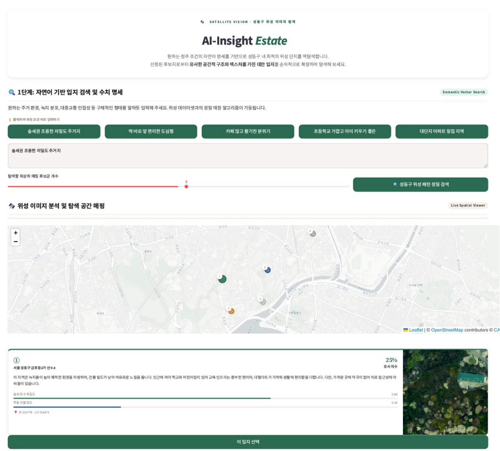

# AI-Insight Estate
> 자연어 쿼리로 위성·항공 이미지에서 시각적으로 유사한 입지를 탐색하고, Solar LLM 기반 입지 분석 리포트를 자동 생성하는 멀티모달 검색 시스템

[← 포트폴리오 홈으로](../README.md)



| 항목 | 내용 |
|---|---|
| 기간 | 2026.03 ~ 2026.06 |
| 팀 구성 | 2인 |
| **내 역할** | **Solar LLM 프롬프트 설계 및 반복 실험, 오프라인 B 인덱싱 전체, 온라인 실시간 처리 파이프라인, FAISS/SQLite DB 구축, Streamlit 프론트, 성능 최적화 (데이터 수집 공동)** |
| 팀원 담당 | 오프라인 A — 위성 이미지 수집·타일링·전처리, 텍스트 데이터셋 구축, CLIP ViT-L/14 LoRA 파인튜닝 |
| 기술 스택 | CLIP ViT-L/14 (LoRA), FAISS, SQLite, Solar LLM (Upstage), Kakao Local API, VWorld API, Streamlit |
| 링크 | [GitHub](https://github.com/SYNAPSE-duksung/AI-Insight-Estate) |

## 한눈에 보기
- 문제: "나무가 많고 조용한 동네"처럼 키워드·조건 필터링으로는 찾을 수 없는 입지를, 사용자가 자연어로 설명하면 찾아 주고 싶었다.
- 내가 한 일: 팀원이 파인튜닝한 CLIP 가중치를 로드해 인덱싱과 실시간 검색 파이프라인을 만들고, Solar LLM 리포트 프롬프트와 응답 시간을 개선했다.
- 결과: 리포트가 수치 나열에서 거주자 관점 설명으로 바뀌었고, 응답 시간이 30초~1분에서 20초 내외로 줄었다.

## 시스템 구조

**오프라인 처리**

```
[오프라인 A — 팀원]
위성 이미지 수집 → 타일링·전처리 → 텍스트 데이터셋 구축 → CLIP ViT-L/14 파인튜닝 (LoRA)

[오프라인 B — 본인]
광진구·송파구·중구 위성 이미지 수집
  → 타일링·전처리 (224×224, district 키 태깅)
  → CLIP Image Encoder 추론 (팀원이 파인튜닝한 가중치를 로드, 학습 없음)
  → 512차원 임베딩 추출 → FAISS + SQLite 구축
```

**온라인 실시간 처리 (본인)**

```
STEP 1 — 자연어 기반 입지 검색
자연어 쿼리 → CLIP Text Encoder → FAISS Cosine Sim Top-K 검색
  → 결과 카드 반환 (유사도, 수목·건물밀도, OSM 타일)

STEP 2 — 이미지→이미지 유사 입지 탐색
탐색 기준 지역 선택 → CLIP Image Encoder → FAISS 검색 (district 필터)
  → Kakao Local API (인프라 통계) + Solar LLM (입지 분석 리포트 생성)
  → Streamlit 렌더링
```

FAISS DB는 동별로 분리해 만들었다. 동 단위 검색 케이스가 명확했고, 검색 대상을 나누는 편이 레이턴시 측면에서도 유리하다고 판단했다.

## 주요 의사결정 / 문제 해결

### 1. Solar LLM 리포트: 숫자 나열에서 거주자 관점으로
수치 데이터와 POI 개수를 LLM에 그대로 전달하자 리포트가 수치 나열에 그쳐 거주 체감이 전달되지 않았다.

Before
> "이 지역은 녹지율 49.2%, 건물밀도 57.3%로 주거환경이 쾌적하며, 1개의 도보권 지하철역을 갖추고 있습니다. 교육 인프라는 초등학교 4개, 어린이집·유치원 20개가 있으며 …"

| 문제 | 내용 |
|---|---|
| 숫자 직접 노출 | 49.2%, 35개 등을 나열해 체감이 전달되지 않음 |
| 반복 및 일관되지 않은 주어 | "이 지역은"과 "서울시 성동구에 위치한 이 지역은"이 교차 |
| 불필요한 정보 노출 | 유사도 점수와 주소지가 출력에 포함되어 혼란 유발 |
| 분량 불일치 | 제한이 없어 카드 UI 길이가 일정하지 않음 |

프롬프트에 다음 지시를 추가했다.

```python
prompt = (
    # ... (컨텍스트 데이터 전달)
    "숫자를 그대로 나열하지 말고 실제 거주자의 체감 관점에서 서술해주세요. "
    "주소지를 출력에 포함하지 말고 지역에 대한 서술만 포함하세요. "
    "문장은 반드시 '~습니다' 체로 통일해주세요. "
    "'이 지역은', '이곳은' 같은 주어로 시작하지 말고 바로 입지 특성부터 서술해주세요. "
    # ...
)
```

After
> "교통 접근성이 편리하며, 교육 인프라가 풍부하게 갖춰져 있습니다. 다양한 편의시설과 의료시설이 가까이 위치해 있어 생활하기에 매우 편리합니다. 특히, 녹지율이 높아 쾌적한 환경을 느낄 수 있습니다."

| 항목 | Before | After |
|---|---|---|
| 숫자 노출 | 49.2%, 35개 직접 노출 | 체감 언어로 전환 |
| 주어 패턴 | "이 지역은" 반복 | 입지 특성부터 바로 서술 |
| 주소·유사도 점수 | 출력에 노출 | 제거 |
| 분량 | 제한 없이 길어짐 | 2~3문장, 100자 이내 통일 |

"이 지역은"으로 시작하는 패턴이 일부 남아 있다. 주소 노출과 숫자 나열 같은 실질적인 품질 문제를 먼저 해결했고, 남은 패턴은 다음 개선 과제로 남겼다.

### 2. 응답 시간 단축
병목은 Kakao Local API 다중 호출과 Solar LLM 호출이 순차로 실행되어 최종 답변까지 30초~1분이 걸리는 것이었다.

| 구간 | 개선 방법 |
|---|---|
| Kakao Local API 다중 호출 | `asyncio` 기반 비동기 병렬 처리 |
| Solar LLM 호출 | `concurrent.futures` 멀티스레딩으로 병렬 처리 |

## 결과

| 항목 | Before | After |
|---|---|---|
| 응답 시간 | 30초~1분 | 20초 내외 |
| 리포트 | 수치 나열 | 거주자 관점 설명, 2~3문장·100자 이내 |

## 배운 점
모델의 정확도만큼, 사용자에게 제공되는 응답 속도와 출력 품질이 서비스의 가치를 좌우한다.
