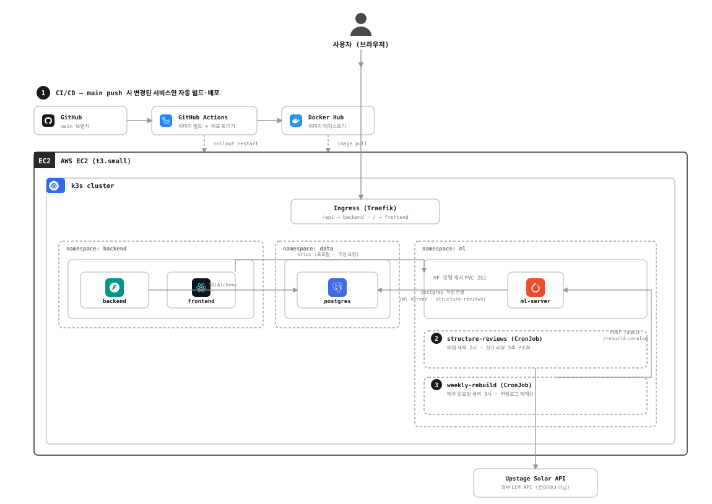

# 결 (LiteRec)
> 짧은 평점이 아니라 흩어진 독서 후기를 모아, 리뷰의 '결(facet)'을 근거로 문학 도서를 추천하는 서비스

[← 포트폴리오 홈으로](../README.md)

| 항목 | 내용 |
|---|---|
| 기간 | 2026.07 ~ 2026.08 |
| 팀 구성 | 4인 (Synapse 2기 여름 프로젝트) |
| **내 역할** | **백엔드 · 인프라** |
| 팀원 담당 | 추천 알고리즘, ML·성능 비교, MLOps·백엔드 (팀원별 분담) |
| 기술 스택 | FastAPI, SQLAlchemy, Alembic, PostgreSQL, Upstage Solar, k3s(Kubernetes), Docker, GitHub Actions, Grafana |
| 링크 | [GitHub](https://github.com/j2nii/literec-system) · [원본 저장소](https://github.com/SYNAPSE-duksung/literec-system) · [배포 링크](http://literec-gyeol.duckdns.org) |

## 한눈에 보기
- 문제: 별점 하나로는 "왜 좋았는지"가 전달되지 않는다. 같은 책도 독자마다 좋아한 이유가 다르다. 그래서 리뷰를 클러스터링해 책의 매력 포인트를 여러 '결'로 나누고, 사용자에게 가장 잘 맞는 결 하나를 실제 리뷰 문장과 함께 근거로 보여준다.
- 내가 한 일: 새 리뷰가 사람 손 없이 추천에 반영되도록 CronJob 2개를 구현하고, 배포 인프라(k3s, CI/CD)와 백엔드를 맡았다.
- 결과: 구조화에 실패한 리뷰도 누락되지 않고 다음 실행에서 자동으로 재시도되는 배치 구조를 만들었다.

## 주요 의사결정 / 문제 해결

### 1. 신규 리뷰 처리 파이프라인 자동화
서비스 게시판에 새 리뷰가 계속 쌓이는데, 사람이 배치를 수동으로 돌리지 않으면 추천에 반영되지 않았다. 그래서 CronJob 2개를 구현했다.

| CronJob | 주기 | 하는 일 |
|---|---|---|
| `structure-reviews` | 매일 새벽 2시 (`0 2 * * *`) | `is_processed = FALSE`인 신규 리뷰를 책(ISBN) 단위로 묶어 Upstage Solar API로 5축 구조화하고 `review_axes` 테이블에 저장 |
| `weekly-rebuild` | 매주 일요일 새벽 3시 (`0 3 * * 0`) | ML 서버의 `POST /admin/rebuild-catalog`를 호출해, 그 주에 구조화된 리뷰까지 포함한 리뷰 임베딩과 클러스터링을 재계산하고 ML 서버 캐시(카탈로그)를 갱신 |

**데이터 정합성 버그를 막는 설계 결정**
- 원안: 매일 배치는 임베딩만 하고, 주간 배치가 `is_processed`를 일괄 갱신한다.
- 문제: 이 방식은 구조화에 실패한 리뷰까지 "처리됨"으로 영구 표시하는 정합성 버그를 만든다.
- 변경: 책 하나의 구조화에 성공한 시점에만 그 책의 리뷰를 `review_axes` upsert와 `is_processed = TRUE`로 표시한다(한 트랜잭션). 실패한 책의 리뷰는 FALSE로 남아 다음 실행 때 자동으로 재시도된다.
- 결과: 주간 배치는 재계산을 트리거하는 역할만 하도록 책임을 분리했다.
- 초기 리뷰 440건을 구조화한 `data/src/llm_review/` 구현을 새로 만들지 않고 그대로 재사용했다.

### 2. 배포 인프라

- 단일 EC2(t3.small) 위에 경량 Kubernetes(k3s, Traefik Ingress)로 배포했다.
- 네임스페이스를 분리했다: `data`(PostgreSQL StatefulSet, PVC 5Gi) / `backend`(backend·frontend Deployment) / `ml`(ml-server Deployment + CronJob 2개, HF 모델 캐시 PVC 2Gi).
- CI/CD: `main`에 push하면 GitHub Actions가 변경된 경로(`backend/**`, `ML/**`, `app/**`)만 감지해 Docker 이미지를 빌드하고 Docker Hub에 푸시한 뒤 `kubectl rollout restart`로 배포한다.
- 시드 데이터: `seed-data` Job이 `alembic upgrade head`와 `scripts/seed.py`를 실행한다.
- 모니터링: Grafana 대시보드를 사용했다.

### 3. ML 서버 장애 시 엔드포인트별 정책 (백엔드에서 적용)

| 백엔드 호출부 | ML 엔드포인트 | 장애 시 정책 |
|---|---|---|
| `PATCH /api/users/me/profile` | `POST /profile/build` | 실패해도 프로필 저장 자체는 성공 처리 |
| `GET /api/recommendations` | `POST /recommend` | 홈 화면 주 콘텐츠라 실패를 숨기지 않고 에러 노출 |
| `GET /api/reviews/{id}/similar-books` | `POST /similar-books` | 보조 섹션이라 빈 상태로 조용히 대체 |

## 결과 (팀 결과)
팀원 4명이 88권 각각에 "내 취향에 얼마나 맞는지(0~3점)"를 직접 평가한 라벨로 오프라인 검증했다(relevance ≥ 2를 정답 기준으로 사용). 추천 알고리즘과 성능 비교는 팀원 담당이며, 아래 수치는 팀 결과다.

| model | NDCG@5 | NDCG@10 | NDCG@20 |
|---|---:|---:|---:|
| random | 0.373 | 0.401 | 0.415 |
| popularity (개인화 없음) | 0.271 | 0.372 | 0.460 |
| **결 기반 추천** | **0.653** | **0.570** | **0.553** |

## 한계와 다음 단계
- 팀원 4명 파일럿 데이터라 표본이 작아 통계적으로 확정적인 결론은 아니다.

## 배운 점
'인공지능 플랫폼 실습/설계' 수업에서 모델 서빙·추론 분산 처리를 접하며 MLOps에 관심을 갖게 되었고, 이 프로젝트에서 새 데이터가 사람 손 없이 추천에 반영되도록 파이프라인을 자동화하며 운영 단계를 직접 다뤘다.
