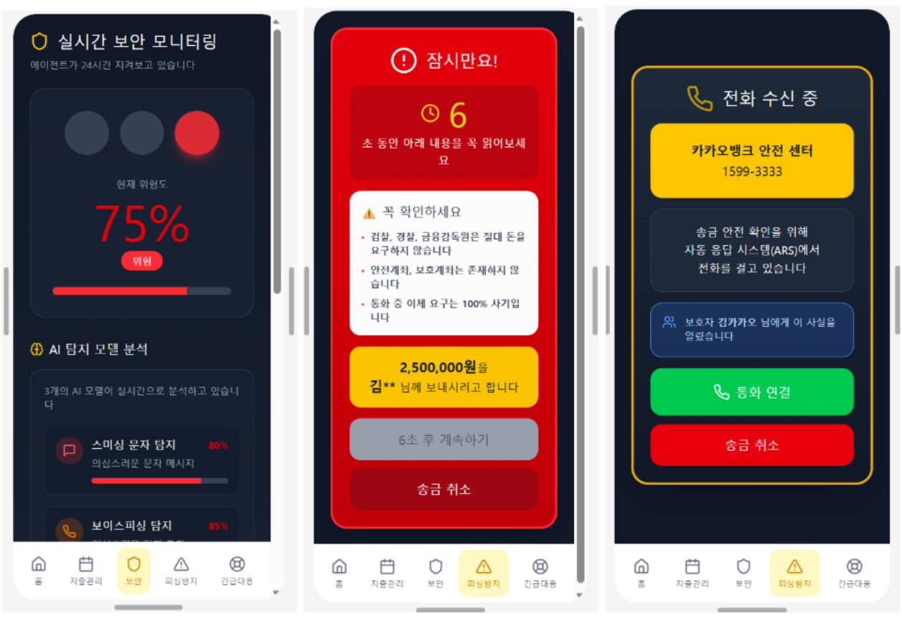

# Phishing-Break
> 시니어 사용자의 문자 정보를 분석해 금융사기 위험을 사전에 탐지하고 단계적으로 개입하는 에이전트

[← 포트폴리오 홈으로](../README.md)



| 항목 | 내용 |
|---|---|
| 기간 | 2026 – 진행 중 |
| 팀 구성 | 3인 |
| **내 역할** | **스미싱 탐지 모델 모듈 — 데이터셋 설계·수집, 전처리 파이프라인, 파인튜닝** |
| 기술 스택 | XLM-RoBERTa, Python |
| 링크 | [GitHub](https://github.com/j2nii/Phishing-Break) · FIN:NECT 2026 출품작 |

서비스는 은행 앱 내장을 전제로 기획했다. 구현 범위는 모듈, 파이프라인, 웹 데모까지이며 앱 구현은 하지 않았다.

## 한눈에 보기
- 문제: 시니어 사용자의 문자를 분석해 금융사기 위험을 사전에 탐지해야 하는데, 정상 문자를 스미싱으로 잘못 차단하는 것이 시니어 사용자에게 가장 큰 불편을 준다.
- 내가 한 일: 스미싱 탐지 모델의 데이터셋을 직접 재구축하고, 전처리 파이프라인과 파인튜닝을 맡았다. 오탐을 발견한 뒤 Hard Negative를 추가하고 핵심 지표를 Accuracy에서 오탐률(FPR)로 바꿨다.
- 결과: Test set 2,310건 기준 오탐률 1.04%(백본 3.12%), F1 0.99.

## 주요 의사결정 / 문제 해결

### 1. 데이터셋을 직접 재구축했다
공개 한국어 피싱 데이터셋의 정상 데이터에 세 가지 결함이 있었다.

- 일상 대화 데이터만 포함되어 금융·공공 알림 문맥을 정상으로 학습하지 못한다.
- 악성 댓글 데이터가 정상 텍스트에 섞여 오탐률을 높인다.
- 음성→텍스트(STT) 변환 데이터가 섞여 문자 특유의 형식 학습을 방해한다.

스미싱 '문자' 도메인 모델이므로 데이터도 '문자'로서의 특징을 갖춰야 한다고 판단했다. 악성 댓글과 STT 데이터는 쓰지 않고, 공공기관 공식 발송 문구와 실전 알림톡을 기반으로 정상 데이터셋을 다시 만들었다.

| 구분 | 출처 | 선택 근거 |
|---|---|---|
| 정상 (Label 0) | 행정안전부 긴급재난문자 | 공공기관 발신 문자의 실제 문체 반영 |
| 정상 (Label 0) | 경기도 군포·안양·평택시 알림톡 | 지자체 복지·민원 발송 패턴 다양성 확보 |
| 정상 (Label 0) | 외교부 안전정보 SMS | 공공기관 특유의 격식체 알림 학습 |
| 정상 (Label 0) | KakaoChatData | 한국어 일상 대화 텍스트 |
| 스미싱 (Label 1) | meal-bbang/Korean_message (HuggingFace) | 실제 유포된 한글 피싱·스미싱 본문 |
| 스미싱 (Label 1) | Ez-Sy01/KOR_phishing_Detect-Dataset (GitHub) | 다양한 변종 스미싱 시나리오 |

클래스별로 8:1:1 독립 분할한 뒤 병합해 분포를 일정하게 유지했다. Val/Test는 정상:스미싱 = 2:1로 실제 환경 분포를 반영하고, Train은 1:1로 균형 있게 학습시켰다.

| 세트 | 정상 | 스미싱 | 합계 |
|---|---|---|---|
| Train | 6,156 | 6,156 | 12,312 |
| Val | 1,540 | 770 | 2,310 |
| Test | 1,540 | 770 | 2,310 |

위 수치는 Hard Negative 추가 후 기준이다.

### 2. 전처리 파이프라인을 처음부터 설계했다

```
원본 SMS 텍스트 수집
  → URL 토큰 치환 (http://... → __URL__)
  → NFKC 전각문자 정규화 (ａｂｃ → abc)
  → 클래스별 8:1:1 독립 분할 후 병합
  → XLM-RoBERTa 토크나이저 입력
```

- URL을 `__URL__`로 치환한 이유: URL 자체를 학습하면 특정 도메인에 과적합될 수 있다고 판단했다. "URL이 포함된 문자"라는 패턴을 학습하도록 했다.
- NFKC 정규화를 넣은 이유: 스미싱이 탐지 우회를 위해 전각 문자를 쓰므로, 표준 형태로 바꿔 입력을 일관되게 했다.

### 3. 오탐을 발견하고 해결했다

**발견.** 파인튜닝 후 Accuracy가 높게 나와 완성됐다고 판단했다. 그런데 내가 실제로 받은 금융기관의 정상 안내 문자를 넣어 보니 피싱으로 분류됐다. 이후 테스트에서 정상적인 금융 알림, 인증번호, 광고 문자도 스미싱으로 오탐되는 것을 확인했다.

**원인: Shortcut Learning.** 정상 데이터에 금융·광고·인증 문자가 전혀 없어서, 모델이 '카카오뱅크', '인증번호', '(광고)' 같은 단어 자체를 스미싱 신호로 학습했다. 테스트셋에도 이런 문자가 없었기 때문에 높은 Accuracy가 문제를 가리고 있었다.

**해결 1 — Hard Negative 추가.** 오탐 샘플을 `hard_negative_samples.csv`로 따로 모으고 아래 유형의 정상 데이터를 추가했다. 개인정보는 마스킹했다.

- 금융 알림: 카카오뱅크, 시중은행 카드 결제·입출금 알림
- 합법적 광고 문자: `무료수신거부` 안내가 포함된 텍스트
- 인증번호 문자: `[Web발신] 본인확인 인증번호` 정형 템플릿

**해결 2 — 핵심 지표를 Accuracy에서 오탐률(FPR)로 변경.** 정상 문자를 스미싱으로 잘못 차단하는 것이 시니어 사용자에게 가장 큰 불편을 준다고 판단해 오탐률을 핵심 개선 지표로 새로 정했다.

## 결과
Test set 2,310건, Hard Negative 추가 후 기준.

| 지표 | 백본 모델 | 파인튜닝 모델 | 개선폭 |
|---|---|---|---|
| Accuracy | 0.9597 | **0.9931** | +0.0333 |
| Precision (스미싱) | 0.9379 | **0.9796** | +0.0417 |
| Recall (스미싱) | 0.9416 | **1.0000** | +0.0584 |
| F1-Score (스미싱) | 0.9397 | **0.9897** | +0.0500 |
| False Positive Rate (핵심 지표) | 0.0312 | **0.0104** | −0.0208 |

- 처음 오탐됐던 실제 금융기관 문자도 정상으로 분류됐다.

## 한계와 다음 단계
- Hard Negative로 정상 결제 문자만 추가했기 때문에, 같은 형식을 흉내 낸 스미싱에는 반대 방향의 지름길(결제 문자 형식 = 정상)이 생겼을 수 있다. 유사 형식 스미싱 샘플로 양방향 검증하는 것이 다음 과제다.
- 실제 환경 기준의 일반화 성능을 계속 재평가할 예정이다.
- 향후 개선 아이디어(미구현): 문자 한 통만 보고 판단하는 모델을 전적으로 믿기보다, 해당 문자 수신 전후의 신호를 함께 보는 것이 서비스 관점에서 유리하다고 판단했다.

## 배운 점
높은 테스트 점수보다 실제 데이터의 구성과 분포를 먼저 의심해야 한다. 현장 데이터는 과제용 데이터처럼 깔끔하지 않고 분포도 계속 변한다.
