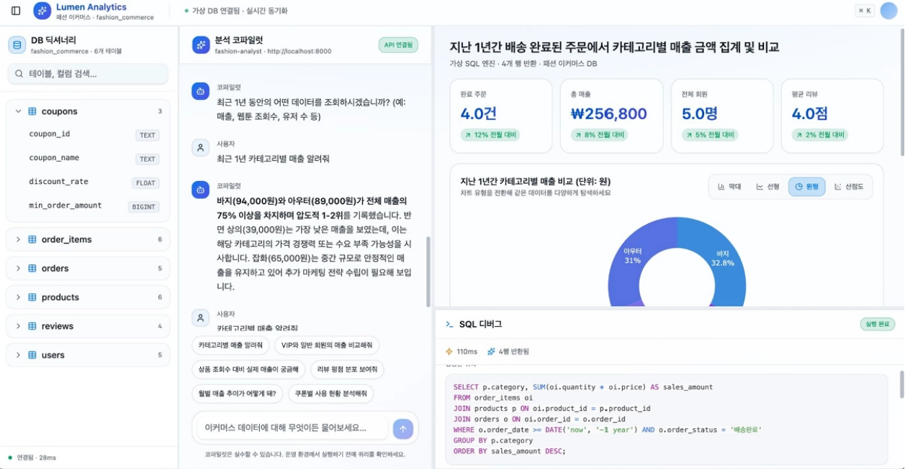

# QueryTalk
> 자연어로 질문하면 AI가 SQL을 생성해 데이터를 조회하고 인터랙티브 차트로 시각화해 주는 분석 플랫폼

[← 포트폴리오 홈으로](../README.md)

> 해커톤 제한 시간 내 개발된 프로젝트로, 전체 완성도보다 **에이전트 구조 설계와 안전성 처리**에 집중했습니다.



| 항목 | 내용 |
|---|---|
| 기간 | 2026.5 |
| 팀 구성 | 4인 |
| **내 역할** | **Guardrail Agent, Visualization Agent 개발 및 공통 에이전트 호출 모듈 설계 (백엔드)** |
| 팀원 담당 | Routing Agent, Create SQL Agent(자가치유 포함) |
| 기술 스택 | Python, Solar LLM (Upstage), Plotly.js |
| 링크 | [GitHub](https://github.com/j2nii/2026-1-MixUP-AI-Datathon---team1) · MixUp AI Datathon (Prometheus × TOBIGs × BITAmin) 참가 |

## 한눈에 보기
- 문제: SQL을 모르는 현업도 자연어 질문만으로 데이터를 조회하고 차트로 이해할 수 있어야 한다.
- 내가 한 일: 위험 쿼리를 막는 Guardrail Agent, 차트 타입을 자동으로 고르는 Visualization Agent, 4개 에이전트가 함께 쓰는 LLM 호출 모듈을 설계했다.
- 결과: 해커톤 제한 시간 안에 의도 분류부터 시각화까지 4개 에이전트 파이프라인을 팀이 구현했고, 그중 Guardrail·Visualization Agent와 공통 호출 모듈을 맡았다.

## 전체 에이전트 파이프라인

```
자연어 질문 입력
  → [Agent 1] Routing Agent: 사용자 의도 분류 (SQL 조회 / 일반 대화 / 모호한 질문)   # 팀원
  → [Agent 2] Create SQL Agent: Text-to-SQL 생성 + 자가치유                         # 팀원
  → [Agent 3] Guardrail Agent: 악의적·위험 쿼리 차단                                # 본인
  → DB 조회 실행
  → [Agent 4] Visualization Agent: 차트 타입 자동 선택 + 시각화                     # 본인
  → Plotly.js 기반 인터랙티브 차트 + 인사이트 요약 출력
```

## 주요 의사결정

### 1. Guardrail Agent — 2단계 방어 구조

| 단계 | 방식 | 상태 |
|---|---|---|
| 1단계 | 키워드 필터링 (빠른 차단) | LLM 단독 성능을 측정하기 위해 현재 비활성화 |
| 2단계 | Solar LLM 지능형 검사 | DROP/DELETE 외에 WHERE 절 없는 Full Scan 위험 쿼리까지 감지 |

### 2. Visualization Agent — 차트 타입 자동 선택
비전문가가 차트 타입을 직접 고르는 것 자체가 또 다른 진입 장벽이 된다고 판단해, 데이터 구조를 기반으로 LLM이 자동 추천하도록 설계했다.

| 데이터 패턴 | 선택 차트 | 근거 |
|---|---|---|
| 날짜·월·연도 등 시간 흐름 | Line Chart | 시계열 추세 표현 |
| 항목·카테고리 간 수치 비교 | Bar Chart | 크기 비교에 직관적 |
| 전체 비율·점유율 분석 | Pie Chart | 비율 파악에 적합 |

### 3. 공통 에이전트 호출 모듈
4개 에이전트가 같은 인터페이스로 Solar LLM을 호출하도록 공통 코어 함수를 설계했다. 각 에이전트는 고유한 system_prompt만 정의하면 되고, LLM 호출 로직은 한 곳에서 관리한다.

```python
def call_solar_agent(system_prompt: str, user_prompt: str, temperature: float = 0.1) -> str:
    """모든 에이전트가 공통으로 사용할 Upstage Solar Pro 호출 코어 함수"""
    ...
```

temperature는 에이전트 특성에 맞게 조정했다.
- Guardrail Agent: `temperature=0.0` — 결정론적 판단으로 매번 동일한 안전 기준을 적용
- Visualization Agent: `temperature=0.1` — 인사이트 문장 생성에 약간의 유연성 허용

## 한계와 다음 단계
- 해커톤 결과물로, 이후 고도화하지 못했다.
- 정확도 평가셋이 없다.
